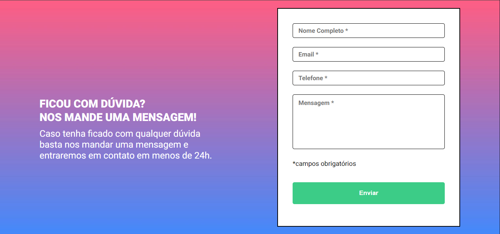
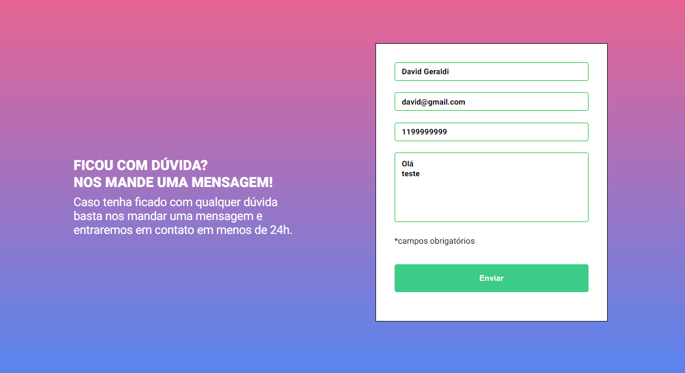
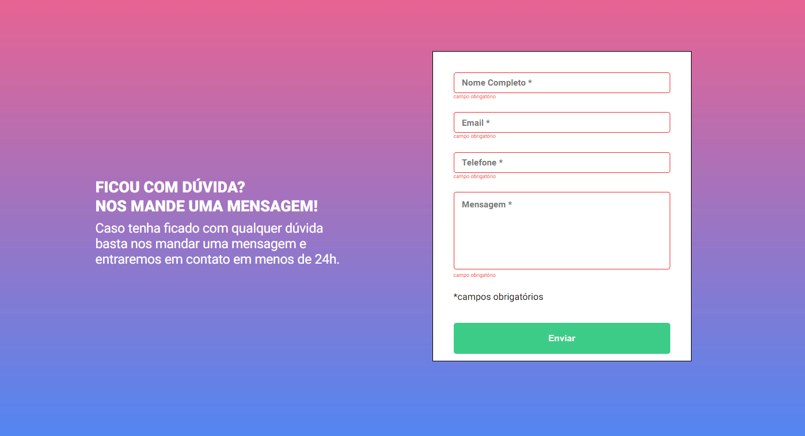
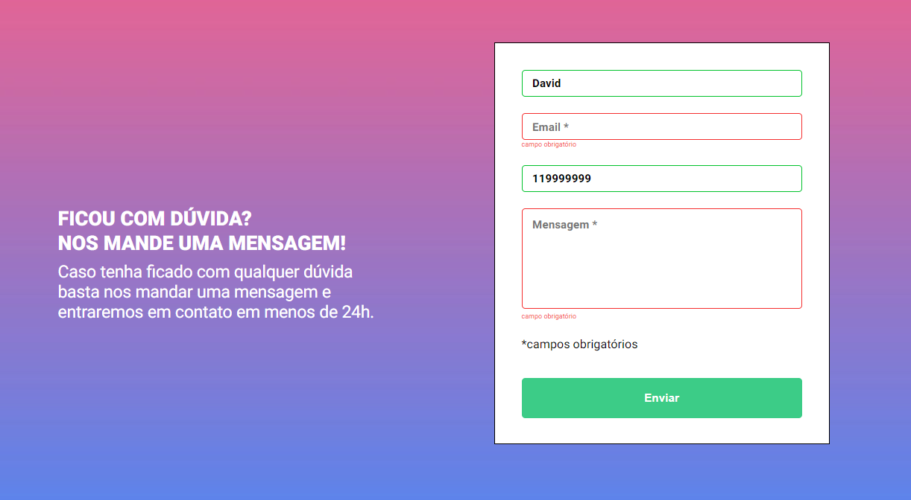
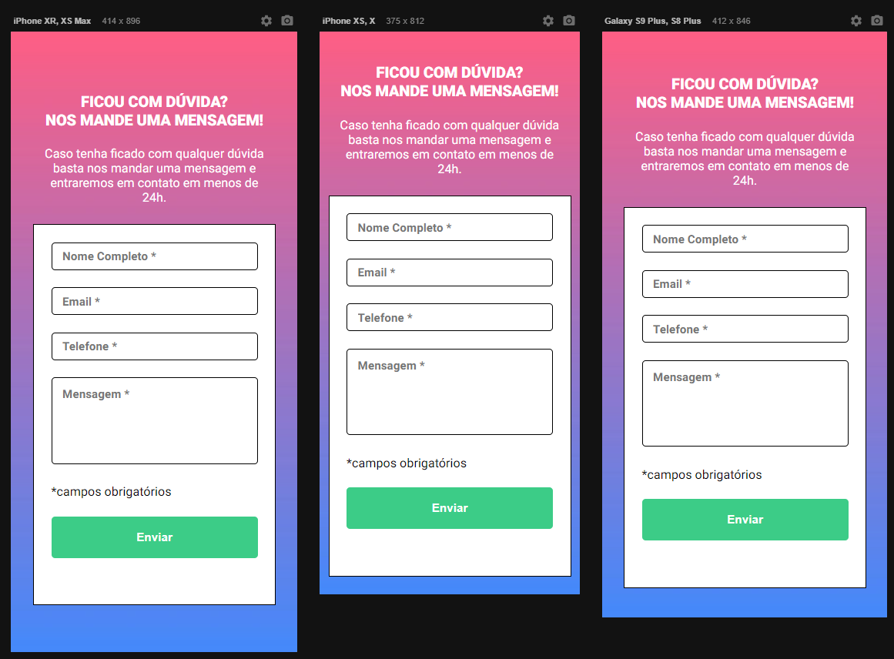

# Quest HMTL, CSS E JS intermediário

Neste desafio foi proposto um formulário de dúvida. Com o layout proposto pelo figma foi resolvida a quest.

## Sobre o desafio

Para a realização do desafio foi utilizado inputs do tipo text, number, submit e a tag textarea. Além disso, efeitos de evento criados pelo JavaScript para certas ocasiões:

## Layout inicial desktop:
Layout da página ao ser carregada:

## Layout em caso de todos os campos compeltos por texto:

## Layout em caso algum campo obrigatório não seja preenchido:

## Layout para mobile:

## Conclusões do desafio

Foi desafiador a parte de JavaScript no evento de despertar o alerta e ativar o display do "campo obrigatório". 
Entendi os conceitos de eventos do JS.

## Tecnologias usadas:

 
  
  
  

